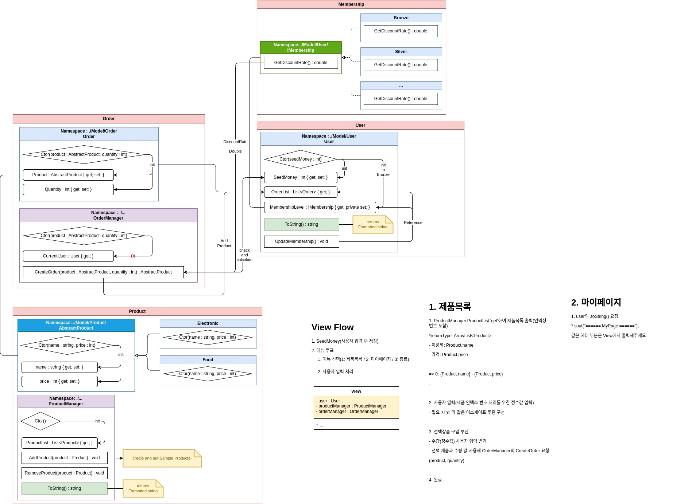

# 간단한 Vendor 프로그램
## 1. Introduction
- 간단하게 고객이 초기자금을 입력하고, 상품을 구매하는 프로그램입니다.
- 상품은 독립된 등록 모듈을 가지고 있으나, 별도의 계정 도메인을 다루지 않으므로 상품은 런타임 이전에 견본으로 등록됩니다.

## 2. Arch.
- 프로그램은 크게 3개의 도메인으로 구성됩니다.
  1. 고객(단일 사용자)
  2. 상품
  3. 주문
  4. 멤버십 등급



## 3. How to Run
### Build
```bash
./gradlew build
```

### Run
```bash
java -jar build/libs/..._1.0-SNAPSHOT.jar
```

## 4. Flow
1. 고객은 초기 자금을 입력합니다.
2. 고객은 상품을 구매합니다.
3. 고객은 멤버십 등급을 포함한 사용자 정보를 조회합니다.

## 5. Member(Retrospective)
#### [**김동휘**](https://github.com/DokaDev) : User Domain
```
프로젝트 초반 주어진 기간 대비 설계 규모가 다소 컸으나, 현실적인 구현을 위해 기능을 축소하는 과정이 필요했다.

각 도메인의 역할과 책임을 명확히 하고, 그에 따른 기능을 구현하는 것이 중요하다는 것을 느꼈다.
```
#### [**장준영**](https://github.com/finite2030) : Membership Domain
```
```
#### [**석현균**](https://github.com/gusrbstjr) : Product Domain
```
프로젝트를 진행하기 위해 팀원들과의 주제를 자유로운 방식으로 아이디어를 제시하고, 주제를 정하였다. 이를 통해 다양한 아이디어를 접할 수 있어서 좋았었다.

프로젝트가 처음이다보니 주제를 정하고 나서, 그 다음은 어떻게 진행해야 할지 방향을 못잡고 있었을때, 팀원 중 한분이 방향을 잘 잡아주셨기도 하고, 프로젝트 과정 중에 팀원 한분 한분에게 도움을 받아서 생성자와 컬랙션, 메소드에 대해 더 이해할 수 있어서 더 편하게 진행 하였고, 팀원분들께 감사한 시간이었다고 생각한다.

이번 기회를 통해 더 많이 공부하고 성장하여 팀원들에게 완벽한 서포팅을 할 수 있게 노력해야 겠다고 느꼈다.
```
#### [**김진우**](https://github.com/wlsdn) : Order Domain
```
개발은 혼자 하는 것이 아니라 함께하는 것임을 느꼈고, 기술적으로 좀 더 성장했으며 자신감이 생겼다.
```
#### [**김성호**](https://github.com/OOOIOOOIO) : View(Menu)
```
```